# 标签设计打印操作说明

### 一、单类型标签

#### 1. 单标签打印

##### 1.1 自定义标签

**1 - 选择标签组件**
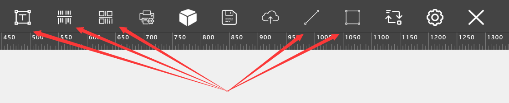

文本框 - 双击可弹出富文本栏进行文本修改
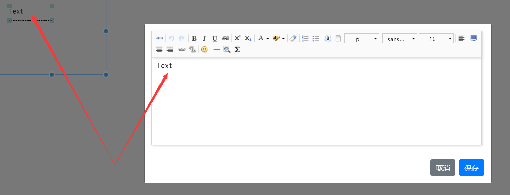

一维码 - 可输入商品id直接进行相应的条码数据拉取，也可手动输入条码数据
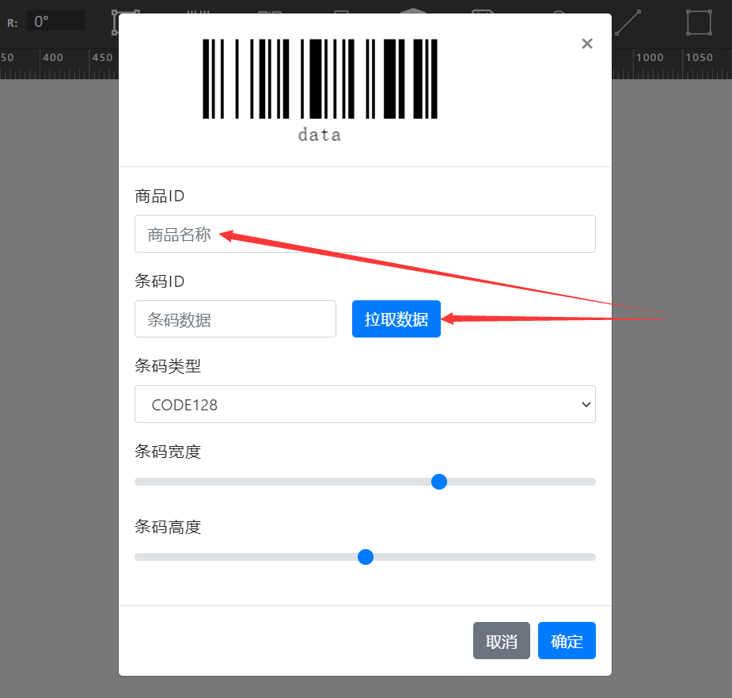

二维码 - 可输入商品id直接进行相应的条码数据拉取，也可手动输入条码数据

**2 - 将所选各组件拖拽于蓝色基准框内进行位置调整**
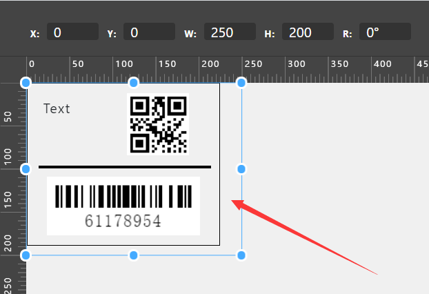

**3 - 进行打印**
打印预览图及打印选项
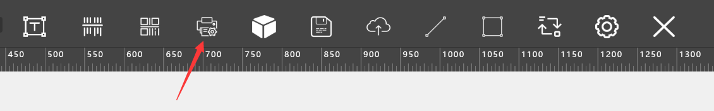
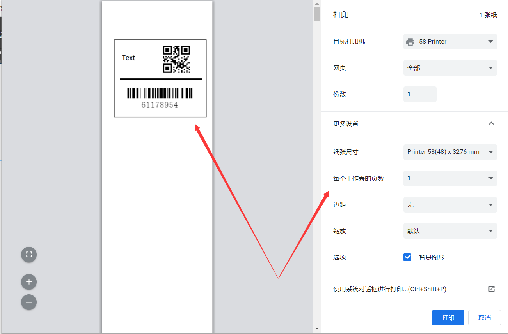

##### 1.2 模板打印

**1 - 选择内置模板**

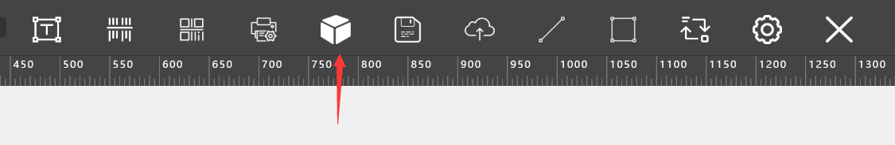

**2 - 点击对应模板**

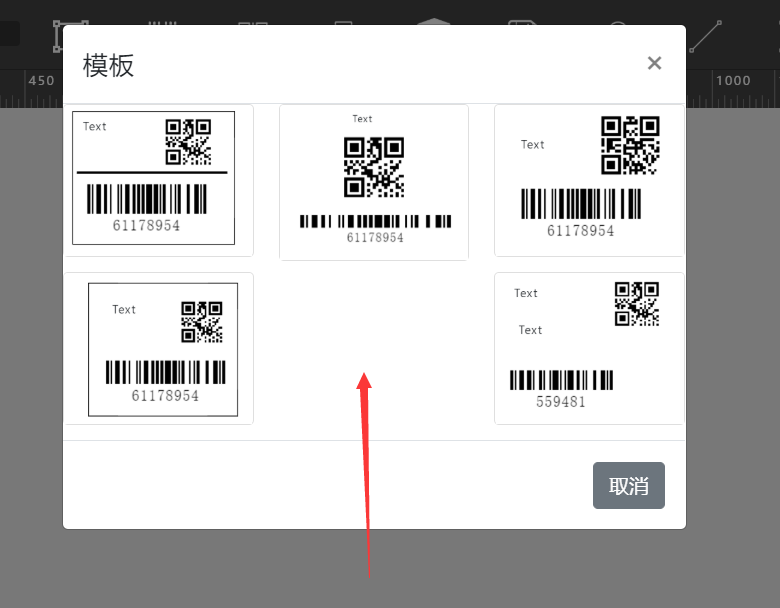

**3 - 对模板进行文本、条码数据的设置（即双击相应组件弹框进行修改）**

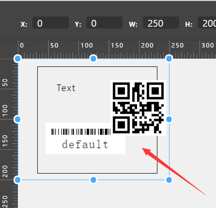

**4 - 打印**

##### 1.3 拉取数据打印

**1 - 选择数据**
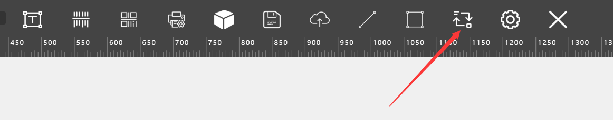

**2 - 选择相应数据的勾选框，并且可以在右上角进行条件的筛选，选择完毕后点击单数据生成**
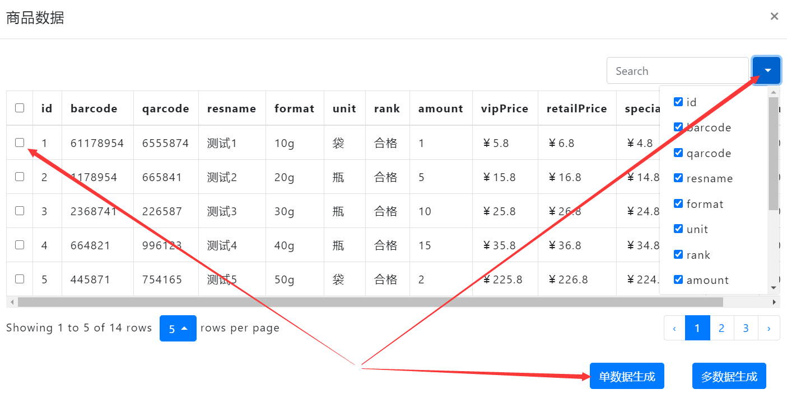

**3 - 将自动生成的文本及条码继续拖拽调整位置**

**4 - 打印**

#### 2. 多标签打印

**1 - 多标签打印与单标签打印前几个步骤相同，生成并调整好整个标签**
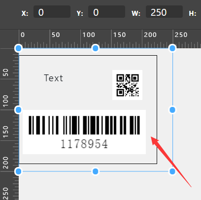

**2 - 打开标签设置并选择对应的行列数**
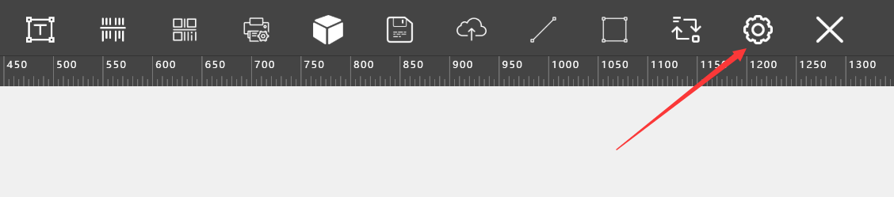
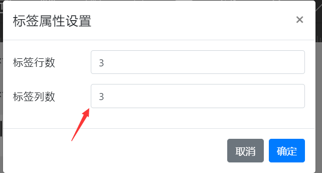
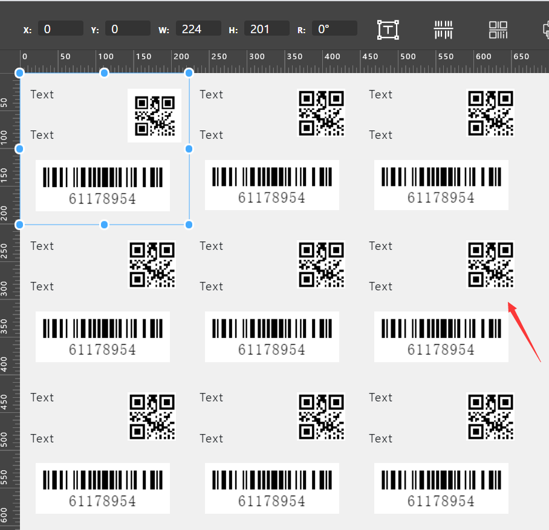

**3 - 进行打印**

### 二、多类型标签

**1 - 生成并调整好一个基础模板框架（自定义、模板、数据拉取任选）**

**2 - 右上角设置筛选条件，选择多个标签数据，点击多数据生成**
>注意：筛选条件中id不产生影响，barcode与qarcode为必选项，去掉则无法自动生成条码，其余选项需与基础模板框架中文本框数量相符合，如基础模板框架中有三个文本框，则筛选条件中除id、barcode、qarcode以外需要勾选三个数据条件
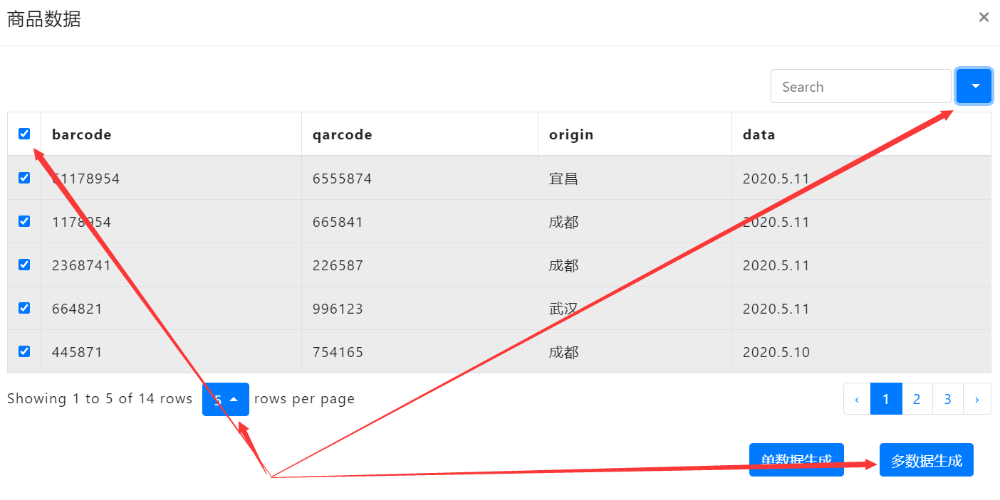

**3 - 打印**